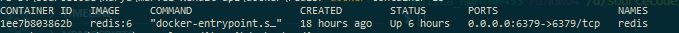
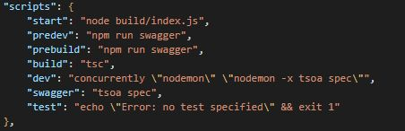
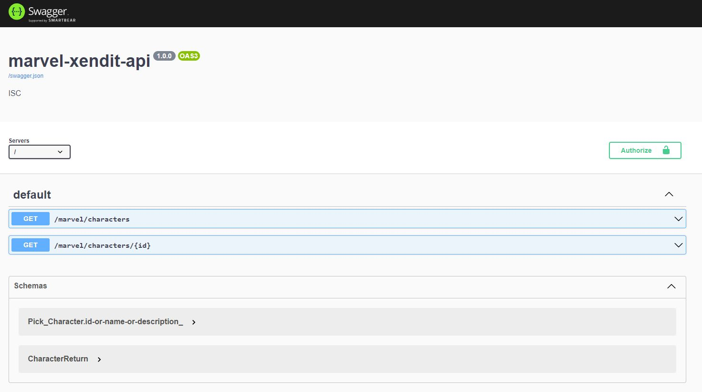
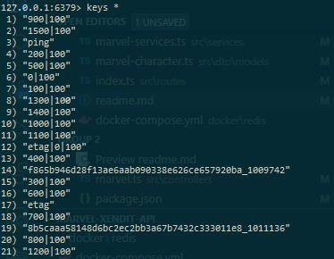

# Marvel API

## Endpoints
- `localhost:8080/marvel/characters/`
- `localhost:8080/marvel/characters/:id`

## Main Stack
- NodeJs
- Express
- Typescript: The main reason why choose Typescript is the static-type. It will be very helpful on large development team, and easy to avoid error. 
- Redis

## Step to run
1. Make sure docker already installed in your machine
2. Make sure the redis already running first before run this application.
3. To run redis, run `docker-compose up -d` from `/docker` directory. This command will add new image and container in docker then will run it.
4. To check whether the redis container is running, run `docker container ls`

5. To access redis, simply by run `redis-cli` in your terminal. Since the redis port in docker container already exposed, you will be able directly access from your machine OS.
6. Install all dependencies with run `npm install`
7. To run the application, simply just run `npm run dev`
8. You can check the other commands by looking on `package.json` file

9. After running successfully, the swagger is available on `http://localhost:8080/docs/`.

10. We use `config` package to handle configuration. All configuration file is stored on `src/config/default.json`. The current available config are `serverConfig`, `marvelConfig`, and `redisConfig`.

## Caching Strategy.
In this application, currently I only use redis as approach to implement cache. The main goal for 2nd problem is, we need to store response data based on `offset` and `limit`. The original API from marvel for `getCharacters` accepting several params, especially limit and offset. As mentioned in documentation in https://developer.marvel.com/docs#!/public/getCreatorCollection_get_0, the accepted max limit value is only 100, but count of all characters data is about 1559. So, to accommodate this, we need to cache call's response for each 100 data that separated by offset and limit.

Since the limit for each call is 100, so we need to set the offset by 0, 100, 200, ... , until check the data's amount is less than 100.

The official API endpoint to get characters is 
`https://gateway.marvel.com:443/v1/public/characters?apikey=<publicKey>hash=<ts+publicKey+privateKey>&ts=<ts>&limit=<limit>&offset=<offset>`

Since in the beginning the cache still not available yet, we need to call endpoints multiple time then store in cache

| Offset | Limit | Cache (Redis) Keys |
| ------ | ----- | ------------------ |
| 0 | 100 | `0|100` |
| 100 | 100 | `100|100` |
| 200 | 100 | `100|100` |
| 300 | 100 | `100|100` |
| 400 | 100 | `100|100` |
| ... | ... | `...|100` |
| 1500 | 100 | `1500|100` |



as displayed in screenshot, I also store `etag` information using `etag|<offset>|<limit>` format. Why the naming using format like this? Based on my investigation, the etag for each `<offset>|<limit>` is different. So to accommodate this, in current version I only store the first offset group etag in redis, which is `etag|0|100`.

Based on above information, the following is the pseudo-code for caching strategy in current version :
```
START CachingForGetMarvelCharacters
    Get currentEtag from Redis
    SET Start to TRUE
    IF (currentEtag)
        Do First Call using currentEtag as `If-None-Match` headers, to get the current version of API result.
        Define Cache to True/False
    ELSE
        Do First Call to get etag then store it to Redis
        Define Cache to True/False
    ENDIF

    WHILE (Start === TRUE)
        IF Cache for `offset|limit` is available, grab from there.
        ELSE Get from API, then store it to Redis

        Processing data to fulfill output format
    END WHILE

    RETURN result
END

```


## Missing & Improvement
- We haven't implemented unit test yet due to the deadline. Although the time for this assignment is over, I'm planning to continue by adding unit test and will be push the new changes coming soon, in another day.
- **Cache Strategy** still can be improved. We can improve the caching to store each etag on specific `offset|limit`. Currently we only store the etag in Redis for `etag|0|100`. We can update the process to store etag for other `offset|limit` as well, such as `etag|100|100`, `etag|200|100`, `etag|300|100`, etc.
- Currently Docker is only use for Redis. In next phase, we will add docker for the application as well.


